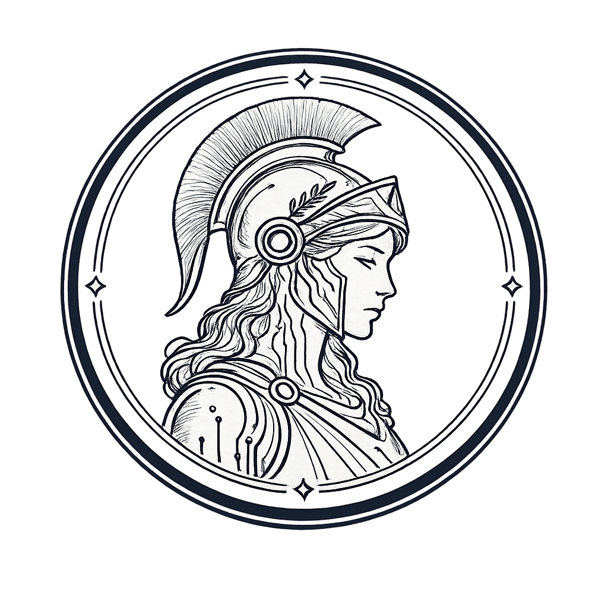

# Athena (Athena-Swarm)

<p align="center">
  
  <!-- TODO: Replace kairos.png with athena.png -->
</p>


$Athena 
CA - 0xdAd76f49Ec95AbCa73349a21EeC34b9df3Af1961


**Local-first, self-hosted, autonomous multi-agent coding swarm.**

Combines the power of Claw-style tool harness with Hermes-style persistent memory, auto-skill creation, and self-improvement.
Defaults to 100% local via Ollama, but supports any remote model (OpenAI, Groq, xAI/Grok, DeepSeek, etc.) via API keys with auto model fetching.

## ✨ Core Philosophy

- Defaults to fully local (Ollama)
- Optional cloud models via simple `python main.py llm` selector + API key (auto-fetches model list)
- Full user control + explicit approval for every destructive action
- Agents that learn and improve themselves over time

---

## ⚡ TL;DR - One Command Install + Run

```powershell
# Windows PowerShell - Install
cd D:\hermes; python -m venv .venv; .\.venv\Scripts\Activate.ps1; pip install -r requirements.txt

# Then start Athena daemon
python main.py athena
```

---

## 📁 Exact Project Structure

```
athena/
├── core/
│   ├── tools.py           # Full Claw harness (file, bash, git, search)
│   ├── react_loop.py      # Custom ReAct + tool-calling engine
│   ├── kairos_daemon.py   # Autonomous background scanner/fixer
│   └── dashboard_events.py # Global event broadcaster for 3D dashboard
├── hermes/
│   ├── memory.py          # SQLite + ChromaDB hybrid memory
│   ├── skills/            # Auto-generated reusable YAML skills
│   ├── soul.md            # Living user + project preference memory
│   └── self_improve.py    # (future) prompt + skill evolution
├── agents/
│   ├── orchestrator.py    # Swarm coordinator (Oracle)
│   ├── architect.py       # System architect (Nexus)
│   ├── coder.py           # Code engineer (Forge)
│   ├── tester.py          # Test engineer (Cipher)
│   └── scribe.py          # Quality reviewer (Aegis)
├── backend/
│   └── dashboard_api.py   # FastAPI + WebSocket for 3D dashboard
├── dashboard/             # React 19 + Three.js 3D frontend
│   ├── src/
│   │   ├── components/    # Reusable 3D React components
│   │   ├── hooks/         # useDashboard (WebSocket), useStore (state)
│   │   ├── types/         # TypeScript interfaces
│   │   ├── App.tsx
│   │   ├── main.tsx
│   │   └── index.css
│   ├── index.html
│   ├── vite.config.ts
│   ├── tailwind.config.js
│   └── package.json
├── landing/               # Athena landing page (Vite/React)
│   ├── src/
│   ├── package.json
│   └── vite.config.ts
├── interfaces/
│   └── messaging.py       # Unified send_message + command parser (Telegram/Discord/WhatsApp)
├── config.yaml
├── main.py                # Beautiful CLI + `bot` subcommand
├── bot_orchestrator.py    # Central 24/7 multi-platform bot + optional dashboard
├── requirements.txt
├── run_all.bat
├── run_bot_and_dashboard.bat
├── run_dashboard.bat      # Launch 3D dashboard (Windows)
├── run_dashboard.sh       # Launch 3D dashboard (Linux/Mac)
├── run_service.py         # NSSM / systemd / Task Scheduler ready entrypoint
└── README.md
```

## 🚀 Quick Start (Windows)

### 1. Prerequisites

- Python 3.11+
- Git
- [Ollama](https://ollama.com) (for local mode) — optional if you only use remote providers

### 2. One-Liner Install

**Copy & paste this single command into PowerShell:**

```powershell
cd D:\hermes; python -m venv .venv; .\.venv\Scripts\Activate.ps1; pip install -r requirements.txt
```

Alternatively, for `cmd.exe`:
```cmd
cd D:\hermes & python -m venv .venv & .venv\Scripts\activate.bat & pip install -r requirements.txt
```

**Or step-by-step** (if you prefer):
```powershell
cd D:\hermes
python -m venv .venv
.\.venv\Scripts\activate
pip install -r requirements.txt
```

### 3. (Optional) Start Ollama + Pull Local Models

```bash
ollama serve
```

In another terminal (for local use):

```bash
ollama pull qwen2.5-coder:7b          # or bigger
ollama pull deepseek-coder-v2:16b
ollama pull nomic-embed-text
```

**For remote models (OpenAI, Groq, xAI, DeepSeek...)**: just run

```powershell
python main.py llm
```

It will let you pick provider, paste API key → **auto-fetches** all available models, pick one with arrows/numbers, and it becomes the new default instantly.
No code changes needed anywhere.

### 4. First Run

```powershell
python main.py --help
python main.py status
python main.py swarm "Create a FastAPI hello-world endpoint with Pydantic models and tests"
```

### 5. Start the Autonomous Daemon (Athena)

Double-click `run_all.bat` or:

```powershell
python -m core.kairos_daemon
# or one-shot
python -m core.kairos_daemon --once
```

Athena will wake up every 15 minutes (configurable), find issues, and propose fixes — always asking for your approval on changes.

## 🤖 Multi-Provider LLM Support (Ollama + Remote)

Run this any time to switch models or add cloud providers:

```powershell
python main.py llm
```

**What happens:**
1. Shows current provider/model
2. Lists all supported providers (OpenAI, Groq, xAI/Grok, DeepSeek, Together, Fireworks, Ollama)
3. You pick one → if it needs a key, you paste it
4. **Auto-fetches** the full list of models from that provider's API
5. You choose the model (number or name)
6. Optional: save the key locally in config.yaml
7. From that moment on, **every** swarm, claw, athena call uses the new model automatically.

Examples of direct set (non-interactive):
```powershell
python main.py llm --set groq llama-3.1-70b-versatile
python main.py llm --list --key sk-...          # test fetch without saving
```

Supported env vars (recommended, never saved to disk):
- `OPENAI_API_KEY`
- `GROQ_API_KEY`
- `XAI_API_KEY`
- `DEEPSEEK_API_KEY`
- etc.

All ReAct loops, agent calls, and direct `make_llm_call` now go through the unified manager — zero changes in agents or tools needed.

## 📱 Multi-Platform Bot Control (Telegram + Discord + WhatsApp + 24/7 Service)

Control your entire Athena swarm from your phone or Discord server — no need to be at the terminal.

### Quick Start

1. **Install extra packages**
   ```powershell
   pip install -r requirements.txt
   ```

2. **Get tokens**
   - **Telegram**: Open @BotFather → `/newbot` → copy token
   - **Discord**: https://discord.com/developers/applications → New Application → Bot → Token + enable Message Content Intent + add bot to your server
   - **WhatsApp**: Optional (pywhatkit is unofficial & limited). For real use, get WhatsApp Business API.

3. **Configure allowed users + tokens** (edit `config.yaml` or use `.env`)

   ```yaml
   messaging:
     telegram_token: "123456:ABC-DEF..."
     discord_token: "your_discord_token"
     allowed_users: ["987654321"]     # your Telegram user id / Discord user id
   ```

   Or create `.env` in project root (recommended):
   ```
   TELEGRAM_BOT_TOKEN=...
   DISCORD_BOT_TOKEN=...
   ALLOWED_USERS=123456789,987654321
   ```

4. **Launch the bot**
   ```powershell
   python main.py bot
   ```

   Now send in Telegram/Discord:
   ```
   /goal Create a FastAPI endpoint for user login with JWT
   /status
   /athena on
   /help
   ```

   The bot will forward the goal to the full multi-agent swarm and reply with the result on the **same platform**.

### Always-Running 24/7 Service

- **Simple persistent mode (Windows)**:
  Double-click `run_forever.bat` (auto-restarts on crash)

- **Production Windows Service (recommended)**:
  Use [NSSM](https://nssm.cc/)
  ```
  nssm install AthenaBot
  Path: C:\Python311\python.exe
  Arguments: D:\hermes\run_service.py
  ```

- **Linux / systemd**:
  Create a simple service file pointing to `python run_service.py`

- **Optional Web Dashboard** (port 8000):
  ```powershell
  uvicorn bot_orchestrator:dashboard_app --port 8000
  ```
  Visit http://localhost:8000/status and trigger goals from browser.

All responses, logs, and errors go to `logs/bot.log`.

The core (core/, agents/, hermes/) is **completely untouched** — the bot layer only calls the existing public functions (`run_swarm`, `get_react_loop`, etc.).

## 🎨 3D Holographic Dashboard

Real-time command center with 3D AI swarm visualization.

**Quick Launch (Windows):**
```powershell
run_dashboard.bat
```

**Manual Launch (Any OS):**
```powershell
# Terminal 1: Backend
python -m uvicorn backend.dashboard_api:app --reload --port 8001

# Terminal 2: Frontend
cd dashboard && npm run dev
```

Then open: **http://localhost:3000**

**Features:**
- ✨ 3D holographic control tower + 5 agent avatars (Oracle, Nexus, Forge, Cipher, Aegis)
- 🎯 Click agents to focus/see detailed task info + progress
- 📊 Real-time animated stats (tasks, skills, tokens, timer)
- 🎮 Interactive camera (orbit, zoom, drag to rotate)
- 📝 Live terminal feed (color-coded logs)
- 💫 Particle effects synchronized with agent activities
- ⚡ WebSocket real-time updates (<2ms latency)
- 🌊 Light sky gradient theme with glassmorphism panels

**Integrate with your agents:**
```python
from core.dashboard_events import emit_agent_update, emit_log, emit_metrics

emit_agent_update("Forge", "working", "Writing handler", progress=45)
emit_log("✓ Tests passed", level="success", agent="Cipher")
emit_metrics(tasks_completed=42, skills_created=17)
```

All updates appear instantly on the 3D dashboard! Backend: FastAPI + WebSocket. Frontend: React 19 + Three.js.

## 🚀 Run Bot + Dashboard Together (One Command)

Want everything running at once? Use the unified launcher — starts FastAPI backend, React dashboard, and bot orchestrator simultaneously.

**Windows (Batch):**
```powershell
run_bot_and_dashboard.bat
```

**Windows (PowerShell):**
```powershell
.\run_bot_and_dashboard.ps1
```

**Any OS (Python):**
```powershell
python run_unified.py
```

**What it does:**
1. Creates Python venv (if needed)
2. Installs all Python dependencies
3. Creates `npm install` Node modules (if needed)
4. Starts FastAPI backend on http://localhost:8001
5. Starts React dashboard on http://localhost:3000
6. Starts bot orchestrator (listens for Telegram/Discord/etc.)

Then open your browser to **http://localhost:3000** and watch the 3D swarm in action!

**Configuration:**
- Copy `.env.example` → `.env` and add your:
  - `OPENAI_API_KEY`, `GROQ_API_KEY`, etc.
  - `TELEGRAM_BOT_TOKEN`, `DISCORD_BOT_TOKEN`
  - `ALLOWED_USERS` (comma-separated IDs)
  - `VITE_API_URL`, `VITE_WS_URL` (usually defaults work)

See `.env.example` for all available options.

| Command                        | Description                                      |
|--------------------------------|--------------------------------------------------|
| `python main.py swarm "..."`   | Full multi-agent swarm (Oracle → Forge → ...)    |
| `python main.py claw "..."`    | Direct powerful ReAct single-agent mode          |
| `python main.py athena --once` | One autonomous scan + fix cycle                  |
| `python main.py athena`        | Start the 24/7 background daemon                 |
| `python main.py status`        | Memory stats + project health                    |
| `python main.py llm`           | Interactive LLM provider + model selector        |
| `python main.py bot`           | Always-on multi-platform bot + dashboard support |

## 🔒 Safety (Non-negotiable)

- Every file delete, git push, or high-risk shell command **requires explicit approval**
- All operations confined to the project root (path escape protection)
- Full audit trail in `hermes/hermes.log` and SQLite

## 🧠 How It Learns

1. Every successful task → stored in Hermes memory (SQLite + vectors)
2. After complex success → Aegis agent auto-generates a reusable YAML skill in `hermes/skills/`
3. Every 10 tasks → self-improvement loop can rewrite prompts/skills (future)
4. `soul.md` accumulates your preferences and project conventions

## 🧪 Development Tips

- Edit `config.yaml` freely (hot-reloaded in many places)
- Add your own tools in `core/tools.py` — they automatically become available to ReAct
- Skills are just YAML — drop new ones in `hermes/skills/` and the swarm will discover them
- Run with `PYTHONPATH=.` if importing from outside

## 📦 Optional / Future

- Docker-isolated agent execution
- Full self_improve.py with evolutionary prompt optimization
- MCP / A2A protocol support

## 🤝 Contributing

This is a living local system. The best way to contribute is to:

1. Run it on your own repos
2. Let Athena find real issues
3. Improve the agents when they make mistakes
4. Share interesting auto-generated skills

## License

MIT — Use freely. Keep it local. Make it better.

---

**Built with ❤️ for developers who want a true local AI teammate that gets smarter every day.**
